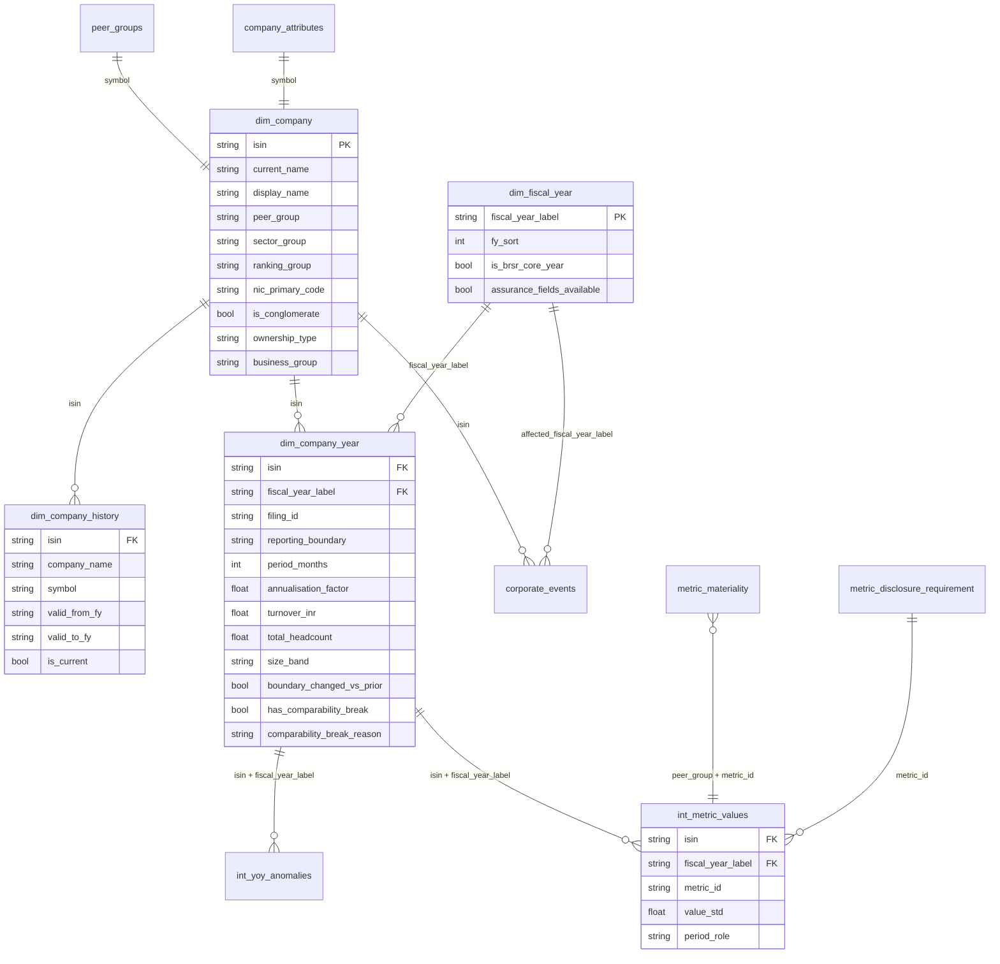

# Data model - identity layer

How the company and time dimensions relate to each other and to the metric values. Built by dbt
on DuckDB; details of each column are in `dbt/models/marts/_marts.yml`.

## Grain and keys

| Table | Grain | Key |
|---|---|---|
| `dim_company` | one row per company | `isin` |
| `dim_company_history` | one row per run of years under the same name and symbol | `isin`, `valid_from_fy` |
| `dim_company_year` | one row per company and financial year (latest filing) | `isin`, `fiscal_year_label` |
| `dim_fiscal_year` (seed) | one row per financial year | `fiscal_year_label` |
| `int_metric_values` | one row per metric value (company, year, period role, breakdown) | `fact_id` |
| `int_yoy_anomalies` | one row per company-year and metric with a YoY move above 40% | `isin`, `fiscal_year_label`, `metric` |
| `int_metric_values_enriched` | same as `int_metric_values`, plus peer group and `is_material` | `fact_id` |

## How a value finds its context

1. A metric value carries `isin` and `fiscal_year_label` (the filing year; `value_fiscal_year_label`
   is the year the value itself belongs to, which differs for prior-year comparatives).
2. Join `dim_company_year` on `isin` + `fiscal_year_label` for the period, boundary, size band and
   break flag of that filing.
3. Join `dim_company` on `isin` for names, peer group, ranking group, NIC sector, ownership.
4. Join `metric_materiality` on `peer_group` + `metric_id` to know whether to rank it, and
   `metric_disclosure_requirement` on `metric_id` to know whether it was required that year.
5. `dim_company_history` is only needed to show the name a company had in a given year.

## Seeds that need human verification

`nic_sector_map` and `nic_code_corrections` (`verified_by` empty). `corporate_events`,
`company_attributes`, `peer_groups` and `metric_disclosure_requirement` are verified by the project owner.
