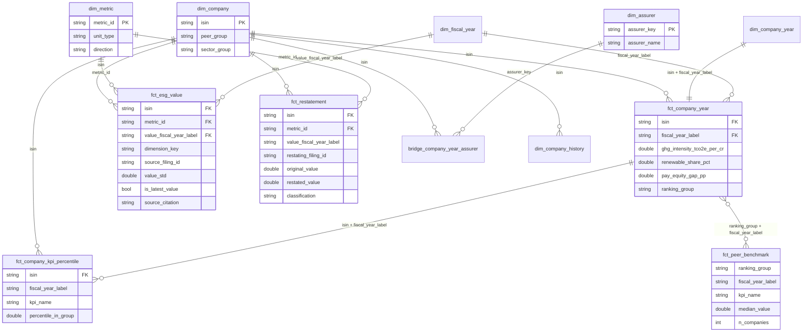
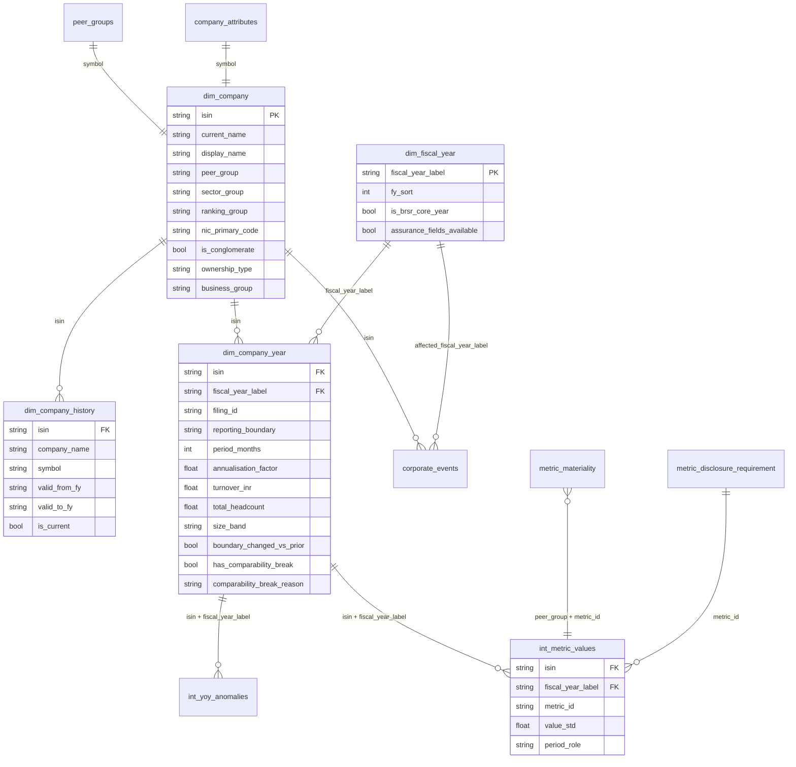

# Data model

Two views of the same warehouse: the **gold star schema** (what reports and Power BI read) and the
identity layer underneath it. Built by dbt on DuckDB; column-level documentation and enforced
contracts are in `dbt/models/marts/_marts.yml`.

## Gold star schema

### Grains

| Table | Grain | Key |
|---|---|---|
| `fct_esg_value` | company x metric x year of the value x breakdown x source filing | `isin`, `metric_id`, `value_fiscal_year_label`, `dimension_key`, `source_filing_id` |
| `fct_company_year` | company x financial year (wide, KPIs) | `isin`, `fiscal_year_label` |
| `fct_peer_benchmark` | ranking group x financial year x KPI | `ranking_group`, `fiscal_year_label`, `kpi_name` |
| `fct_company_kpi_percentile` | company x financial year x KPI | `isin`, `fiscal_year_label`, `kpi_name` |
| `fct_restatement` | company x metric x breakdown x year restated x restating filing | `isin`, `metric_id`, `dimension_key`, `value_fiscal_year_label`, `restating_filing_id` |
| `rpt_restatement_summary` | level (overall / metric / peer group / company) x key | `level`, `group_key` |
| `dim_metric` | one per catalogue metric | `metric_id` |
| `dim_assurer` | one per assurance provider (variants merged) | `assurer_key` |
| `bridge_company_year_assurer` | company-year x assurer | `isin`, `fiscal_year_label`, `assurer_key` |

Every `dim_` and `fct_` model has an enforced dbt contract. Gold tables carry no links to the
exchange: `source_citation` is plain text (company, report, year, filing date).

### Which value is "the" value

`fct_esg_value.is_latest_value` marks, for each company, metric, year and breakdown, the
current-year value from the latest revision of the filing for that year. Prior-year comparatives
(PY, PY2) are kept for the restatement tracker but are never latest. Restatement logic:
[restatement_method.md](restatement_method.md); KPI formulas: [kpi_definitions.md](kpi_definitions.md).

## Identity layer

How the company and time dimensions relate to each other and to the metric values.

## Grain and keys

| Table | Grain | Key |
|---|---|---|
| `dim_company` | one row per company | `isin` |
| `dim_company_history` | one row per run of years under the same name and symbol | `isin`, `valid_from_fy` |
| `dim_company_year` | one row per company and financial year (latest filing) | `isin`, `fiscal_year_label` |
| `dim_fiscal_year` (seed) | one row per financial year | `fiscal_year_label` |
| `int_metric_values` | one row per metric value (company, year, period role, breakdown) | `fact_id` |
| `int_yoy_anomalies` | one row per company-year and metric with a YoY move above 40% | `isin`, `fiscal_year_label`, `metric` |
| `int_metric_values_enriched` | same as `int_metric_values`, plus peer group and `is_material` | `fact_id` |

## How a value finds its context

1. A metric value carries `isin` and `fiscal_year_label` (the filing year; `value_fiscal_year_label`
   is the year the value itself belongs to, which differs for prior-year comparatives).
2. Join `dim_company_year` on `isin` + `fiscal_year_label` for the period, boundary, size band and
   break flag of that filing.
3. Join `dim_company` on `isin` for names, peer group, ranking group, NIC sector, ownership.
4. Join `metric_materiality` on `peer_group` + `metric_id` to know whether to rank it, and
   `metric_disclosure_requirement` on `metric_id` to know whether it was required that year.
5. `dim_company_history` is only needed to show the name a company had in a given year.

## Seeds that need human verification

`nic_sector_map` and `nic_code_corrections` (`verified_by` empty). `corporate_events`,
`company_attributes`, `peer_groups` and `metric_disclosure_requirement` are verified by the project owner.
